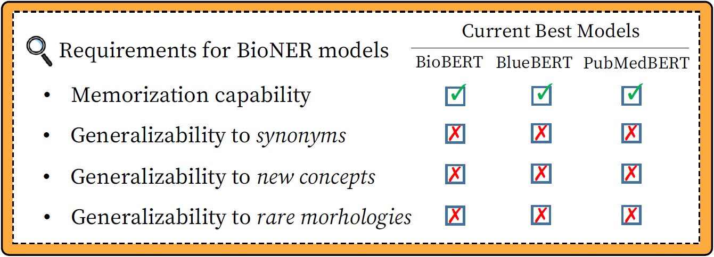

# Generalizability of BioNER Models to Novel Entities

This is the official repository for the paper "How Do Your Biomedical Named Entity Models Generalize to Novel Entities?."
The paper has been accepted by IEEE Access, and is now available in the Early Access ([link](https://ieeexplore.ieee.org/abstract/document/9730848)).

## Overview

Recent NER models seem to be reliable due to their strong F1 performance on benchmarks.
Nevertheless, we can easily observe that they often miss unseen or newly discovered entities such as COVID-19 in real-world problems.
In fact, we found their generalization abilities are limited through a systematic analysis.

<div align="center">
      
</div>

To complement traditional evaluation methods (i.e., measuring overall performance), we propose to evaluate models in terms of three recognition abilities that reliable BioNER models should possess. We briefly describe them below. Please see our paper for formal definitions with detailed descriptions.

* Memorization (**Mem**): The most basic ability is to identify entity mentions that were seen during training.
* Synonym generalization (**Syn**): A BioNER model should be robust to synonyms. While their surface forms are unseen, CUIs (concept unique identifiers) were seen during training.
* Concept generalization (**Con**): While synonym generalization deals with recognizing new surface forms of existing entities, concept generalization refers to the generalization to novel entities or concepts that did not exist before. Their surface forms and CUIs are both unseen.

## Evaluation

### Requirements

To measure the generalizability of a model, install the **seqeval** framework by running `pip install seqeval` or `conda install -c conda-forge seqeval`.
Also, you need (1) **mention dictionary**, (2) **CUI dictionary**, (3) **test set annotated with BIO labels**, (4) **test set annotated with CUIs**, and (5) **model predictions**.
We provide dictionaries and preprocessed datasets in the `resources` directory, but you can replace them with your datasets or model outputs with the same format.


### Data Format
We follow [BioBERT](https://github.com/dmis-lab/biobert-pytorch/tree/master/named-entity-recognition)'s tokenization scheme, which separates tokens based on whitespace and special characters. A single token and label make up a single line. An example for (3) and (5) is given below.

```bash
# BIO annotations

The O
product O
of O
the O
ataxia B
- I
telangiectasia I
gene O
( O
ATM O
) O
was O

...
```

In addition, we need another form of test data that is annotated with CUIs. As shown in the example below, a CUI is labeled at the first token of an entity.

```bash
# CUI annotations

The -
product -
of -
the -
ataxia D001260
- -
telangiectasia -
gene -
( -
ATM -
) -
was -

...
```

### Run Evaluation

When all files are ready, run the evaluation script below.
```
export DATA=NCBI-disease

python evaluate.py \
      --mention_dictionary resources/$DATA/mention_dictionary.txt \
      --cui_dictionary resources/$DATA/cui_dictionary.txt \
      --gold_labels resources/$DATA/test.txt \
      --gold_cuis resources/$DATA/test_cuis.txt \
      --predictions resources/$DATA/biobert/predictions.txt
```


## Model Training

In addition to the evaluation script, we provide the code for training NER models, including our **debiasing method**. 
See the `training` directory.


## References

If you are using scientific artifacts (such as code, datasets, or models) related to our work, please cite our paper. Thank you!

```bibtex
@article{kim2022your,
  title={How Do Your Biomedical Named Entity Recognition Models Generalize to Novel Entities?},
  author={Kim, Hyunjae and Kang, Jaewoo},
  journal={IEEE Access},
  year={2022},
  publisher={IEEE}
}
```

## Contact

Feel free to email Hyunjae Kim `(hyunjae-kim@korea.ac.kr)` if you have any questions.
